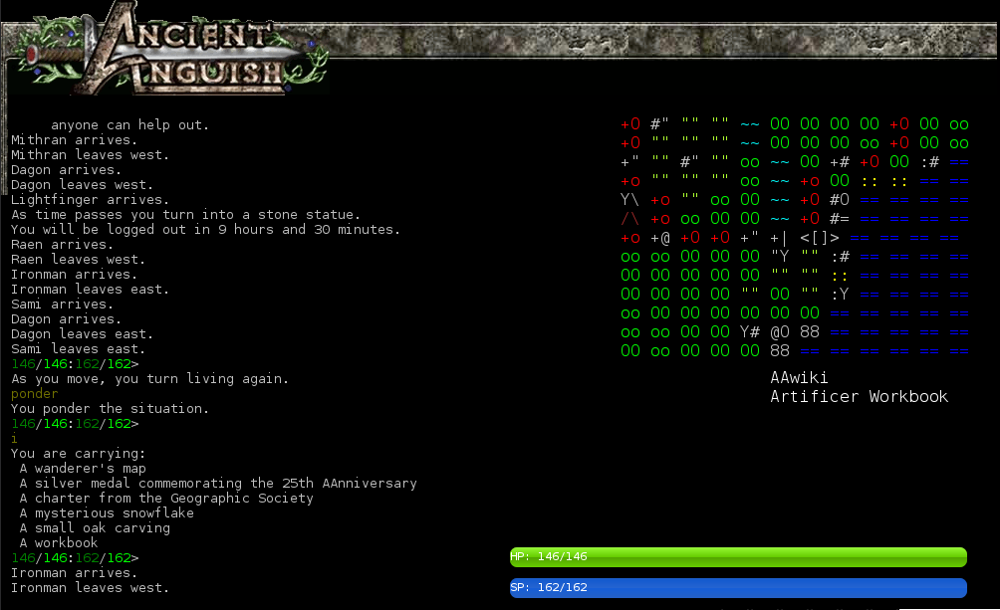

ncient Anguish Mudlet Profile

Intended to function with [Ancient Anguish](http://ancient.anguish.org) using [Mudlet](https://www.mudlet.org/)

## Current features

- Mapper: Uses LUA to display map
- Health meters
- Useful links

To use mapper currently:
`asciiart off` and then `exa map`. This will be updated to support prompt X/Y coordinates (donators) and 'landmark' short room desc.

## Bugs
- Picking up coords from prompt are an issue

## To do
- Class Modules - Ie load useful stuff for ficers/Rangers
- Prettier UI/Layout
- Common buttons (who etc)
- Chat windows
- Highlight stuff like pipe running out
- Status indicators for donator prompt (ie stuffed, drunk)
- 

## WARNING

This is in development. If your characters dies because of it, not my problem.

This will not implement 'auto triggers' which are against AA rules!
